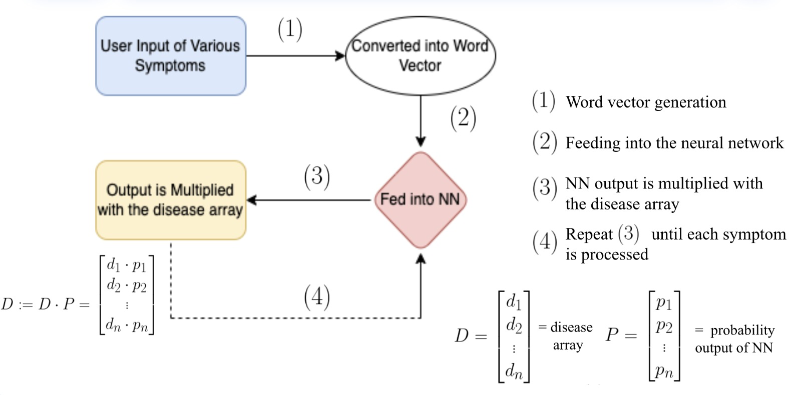
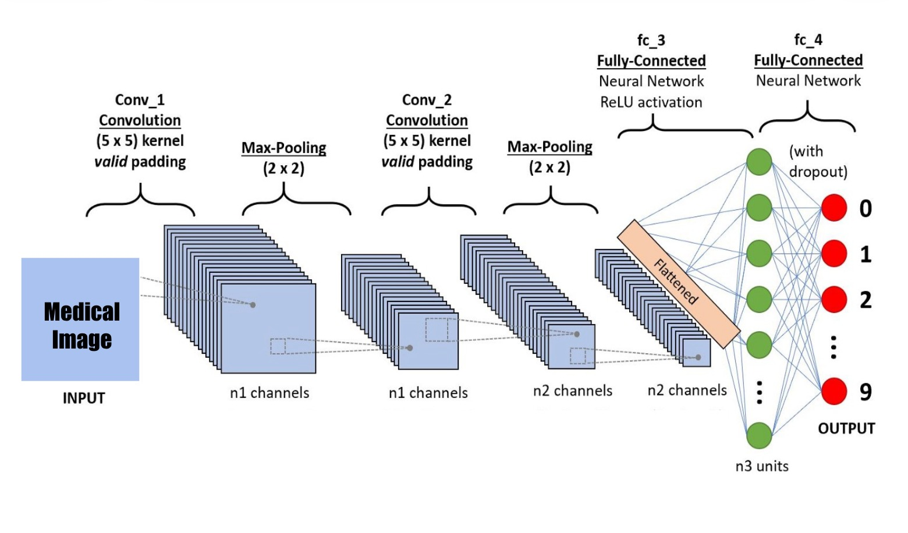

# PhardiApp
A project that enables easy access to healthcare. 

Features:
1) Text-Based Diagnosis
2) Image-Based Diagnosis

Text-Based Diagnosis Architecture:

Image-Based Diagnosis Architecture:

